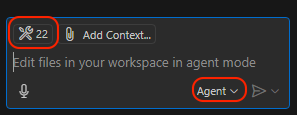

# Codacy MCP Server

MCP Server for the Codacy API, enabling access to repositories, files, quality, coverage, security and more.

## Features / Tools

The following tools are available through the Codacy MCP Server:

### Repository Management

- `codacy_list_repositories`: List repositories in an organization with pagination support.

### Code Quality and Analysis

- `codacy_list_repository_issues`: Lists and filters code quality issues in a repository. This is the primary tool for investigating general code quality concerns (e.g. best practices, performance, complexity, style) but NOT security issues. For security-related issues, use the SRM items tool instead. Features include:

  - Pagination support for handling large result sets
  - Filtering by multiple criteria including severity, category, and language
  - Author-based filtering for accountability
  - Branch-specific analysis
  - Pattern-based searching

  Common use cases:

  - Code quality audits
  - Technical debt assessment
  - Style guide compliance checks
  - Performance issue investigation
  - Complexity analysis

### File Management

- `codacy_list_files`: List files in a repository with pagination support.
- `codacy_get_file_issues`: Get the issue list for a file in a repository.
- `codacy_get_file_coverage`: Get coverage information for a file in the head commit of a repository branch.
- `codacy_get_file_clones`: Get the list of duplication clones (identical or very similar code segments) for a file in a repository. Use this tool to identify potential refactoring opportunities and reduce code duplication.

### Security Analysis

- `codacy_list_srm_items`: Primary tool to list security items/issues/vulnerabilities/findings. Results are related to the organization security and risk management (SRM) dashboard on Codacy. Provides comprehensive security analysis including:

  - SAST (Code scanning)
  - Secrets (Secret scanning)
  - SCA (Dependency scanning)
  - IaC (Infrastructure-as-code scanning)
  - CICD (CI/CD scanning)
  - DAST (Dynamic Application Security Testing)
  - PenTesting (Penetration testing)

  Use this as the first tool when investigating security or compliance concerns.

### Pull Request Analysis

- `codacy_list_repository_pull_requests`: List pull requests from a repository that the user has access to. You can search this endpoint for either last-updated (default), impact or merged.
- `codacy_list_pull_request_issues`: Returns a list of issues found in a pull request. We can request either new or fixed issues.
- `codacy_get_pull_request_files_coverage`: Get diff coverage information for all files in a pull request.
- `codacy_get_pull_request_git_diff`: Returns the human-readable Git diff of a pull request.

### CLI Analysis

- `codacy_cli_analyze`: Uses Codacy's command-line tool to analyze code.


## Setup

### Requirements

Ensure your machine has the following tools installed:
* git
* node.js
  * ensure that the `npx` command runs without issues.

### Personal API Access Token

Get your Codacy's Account API Token from your [Codacy Account](https://app.codacy.com/account/access-management).

You'll need it later in the setup.

### Usage

In supported IDEs like VS Code, Cursor, and Windsurf, the easiest way to install Codacy's MCP Server is to do it from the Codacy extension. If you haven't yet, install the extension from within your IDE, or from any of the available marketplaces ([Microsoft](https://marketplace.visualstudio.com/items?itemName=codacy-app.codacy), [OpenVSX](https://open-vsx.org/extension/codacy-app/codacy)). From the extension panel, just click on Add Codacy MCP Server. Restart your IDE afterwards.

Without the extension, you can still use and install the MCP Server:

### Cursor, Windsurf, and others

Depending on what you are connecting the MCP Server to, you can use the following methods:

- Cursor: edit the `.cursor/mcp.json` file to add the following
- Windsurf: edit the `.codeium/windsurf/mcp_config.json` file to add the following
- Claude Desktop: edit the `claude_desktop_config.json` file to add the following
  
```json
{
  "mcpServers": {
    "codacy": {
      "command": "npx",
      "args": ["-y", "@codacy/codacy-mcp"],
      "env": {
        "CODACY_ACCOUNT_TOKEN": "<YOUR_TOKEN>"
      }
    }
  }
}
```

### VS Code with Copilot

1. For connecting the MCP Server to Copilot in VS Code, add the following to the global config of the IDE:

```json
{
    "mcp": {
        "inputs": [],
        "servers": {
            "codacy": {
                "command": "npx",
                "args": [
                  "-y",
                  "@codacy/codacy-mcp"
                ],
                "env": {
                  "CODACY_ACCOUNT_TOKEN": "<YOUR_TOKEN>"
                }
              }
        }
    }
}
```
You can open the user settings.json file in:

`View > Command Palette > Preferences: Open User Settings (JSON)`

Or open the general settings.json file directly, which according to your OS should be located in:

- for macOS: `~/Library/Application Support/Code/User/settings.json`
- for Windows: `%APPDATA%\Code\User\settings.json` or `%APPDATA%\Roaming\Code\User\settings.json`
- for Linux: `~/.config/Code/User/settings.json`

Don't forget to update the value of `CODACY_ACCOUNT_TOKEN` with your token. 

2. Make sure you have Agent mode enabled: [vscode://settings/chat.agent.enabled](vscode://settings/chat.agent.enabled)

3. Open the Copilot chat and switch the mode to `Agent`. You can check that the MCP server was enabled correctly by clicking on the `Select tools` icon, which should list all the available Codacy tools.



### Node Troubleshooting

#### Claude Desktop

When using NVM with Claude Desktop, NPX may not work. You should first install the MCP Server globally, and then use Node directly:

```bash
npm install -g @codacy/codacy-mcp
```

```json
{
  "mcpServers": {
    "codacy": {
      "command": "/Users/yourusername/.nvm/versions/node/vXX.X.X/bin/node",
      "args": ["/path-to/codacy-mcp/dist/index.js"],
      "env": {
        "CODACY_ACCOUNT_TOKEN": "<YOUR_TOKEN>"
      }
    }
  }
}
```

## Build

Local:

```bash
npm install
npm run update-api
npm run build
```

## Codacy-CLI Support (WIP)

In order to use the [Codacy-CLI](https://github.com/codacy/codacy-cli-v2), it needs to be installed.

## License

This MCP server is licensed under the MIT License. This means you are free to use, modify, and distribute the software, subject to the terms and conditions of the MIT License. For more details, please see the LICENSE file in the project repository.
